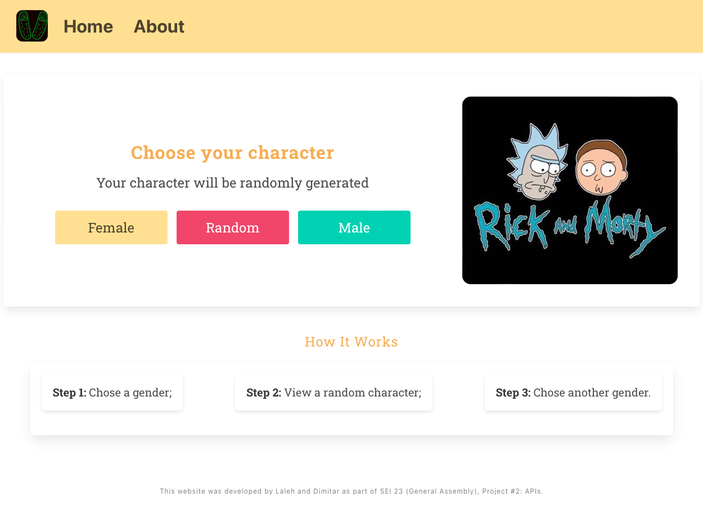
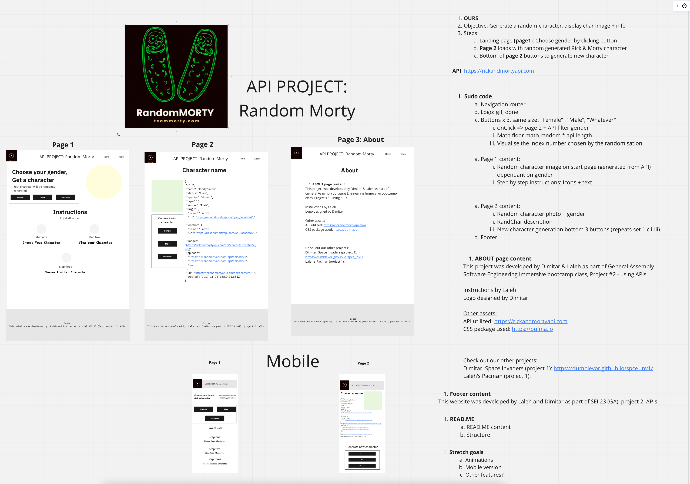
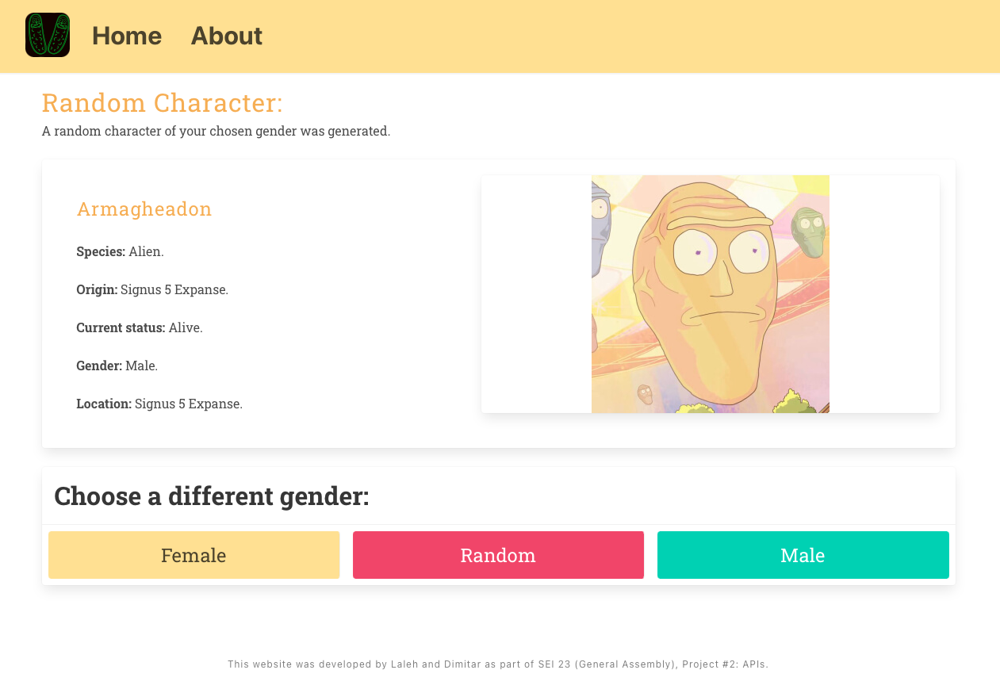

## Random Character from Rick & Morty

### Overview

This is the second project of the software engineering immersive course at General Assembly London. The assignment was to **build a React application** that consumes a **public API**. The project was to be completed in a **group of 2** within **5** over 2 weeks.
My partner and I chose a Rick & Morty API whereas our site would request and display a random character dependant on the user gender selection. 

Access [here](https://dumblevor.github.io/spce_inv1/).

Preview: 

Three buttons are available for selection and we have clear instructions underneath to guide the user.

## Technologies used 

- React
- Bulma
- JavaScript
- Git and GitHub
- HTML
- CSS

## Approach

We wanted to make something simple, but yet fun so we decided on using a Rick & Morty API, inspired by the seriess :  https://rickandmortyapi.com.
We decided on just 3 pages: a landing page, a display page and an about. 

We used the react-router-dom Link elements as buttons to point different genders using a seperate component DisplayCharacter.js.

I took the lead on DisplayCharacter.js - it uses the gender chosen to fetch random character from the API. 
Moreover, if random has been chosen - it will randomise between Female, Male, Genderless and Unknown and then fetch from the API.

The data from the response is then passed through via props to another component - Character.js, which gives the data structure. 
We decided to learn about Bulma na use it for styling this project, which seemed appropriate given the theme. 

## Timeline
- Day 1 - Whiteboarding & pseudo
- Day 2 - MVP
- Day 3 - Bug fixes 
- Day 5 - CSS and styling

### Landing Page

### Character Page
We also decided on providing the option for the user to choose a new gender as an extra feature.

## Assets & credits
- Logo: Dimitar Vidolov (canva.com).
-----